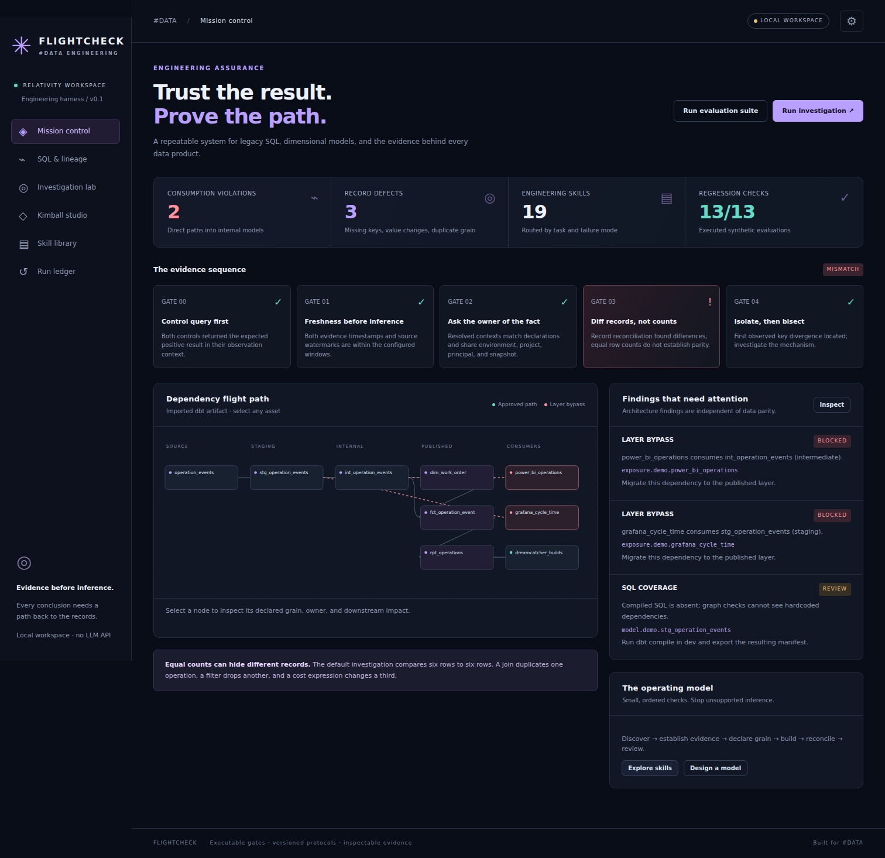

# Flightcheck · de_skillset

An evidence-first data engineering harness for Relativity Space's #DATA workflows: legacy SQL, consumers reading staging/intermediate tables, and Kimball model design.

**Runnable app + CLI + 19 Claude skills + 9 engineering protocols.** All bundled data is synthetic. Project names, dataset patterns, ownership and policy are examples until configured against the actual environment.

**This is a development workbench and static candidate checker.** Imported evidence cannot become ready-for-review or approved. See [hardening changes and remaining integration work](docs/HARDENING.md).



## Start the app

Python 3.11+:

```bash
python -m venv .venv
source .venv/bin/activate
python -m pip install -e '.[dev]'
python -m flightcheck.cli --policy config/policy.yml serve
```

Open **http://127.0.0.1:8000**. On Windows, activate with `.venv\Scripts\activate`.
The first browser load executes a synthetic investigation and audits a synthetic dbt manifest; subsequent visits reuse the latest runs. It does not manufacture a history of past runs.

The app includes:

| Workspace | What works |
|---|---|
| Mission control | Evidence gates, recorded defect counts, interactive dependency graph and findings. |
| SQL & lineage | BigQuery SQL parsing, layer checks, dbt manifest import, transitive impact and hardcoded-relation checks when compiled SQL is present. |
| Investigation lab | Executed SQLite scenarios, typed evidence import, keyed record diff, multiplicity, value witnesses and stage tracing. |
| Kimball studio | Typed grain/dimension/measure specifications; downloadable dbt SQL, contract YAML, grain/relationship tests and Type 2 interval tests. |
| Skill library | Searchable task-specific Claude skills and complete engineering protocols. |
| Run ledger | Actual local run records, JSON exports, input/policy hashes, evaluation results and Claude handoff prompts. |

The default case returns **six rows on each side**, while a join duplicates `OP-003`, a filter drops `OP-004`, and a cost expression changes `OP-002`. It demonstrates why counts are insufficient. A corrected case passes record reconciliation and becomes **ready for review**, never automatically certified.

## Use it with Claude Code

Open this repository in Claude Code. `CLAUDE.md` routes tasks into `.claude/skills/`; `AGENTS.md` supplies the operating contract. For example:

```text
Use /migrate-legacy-query. Start with docs/ENVIRONMENT-HANDOFF.md and config/policy.yml.
Inventory the actual consumers of this query, declare its business grain, reproduce defects
with record witnesses, design the published Kimball interface, and prepare a dev patch with
record-level reconciliation and rollback evidence. Do not assume the example schemas are real.
```

To bring these skills into an existing warehouse repository, copy/merge `.claude/skills`, `protocols`, `templates`, the relevant operating instructions, `config/policy.yml`, and the installed `flightcheck` package. Merge existing Claude settings; do not overwrite them. The supplied PostToolUse hook emits SQL feedback. The optional MCP PreToolUse example requires your real tool name/input schema. See [bounded tools](protocols/09-bounded-tools.md).

## Core rules

1. **Control query first:** an empty result is not evidence until a known-positive control passes in the same source/access context.
2. **Freshness before inference:** distinguish source watermark from query time.
3. **Ask the owner of the fact:** verify object, environment, principal and snapshot.
4. **Diff records, not counts:** compare missing/new keys, values, NULLs and multiplicity.
5. **Isolate then bisect:** follow a record witness through joins, filters and expressions.

Consumers use contracted marts or serving models. Internal staging/intermediate dependencies require migration or a reviewed, scoped, expiring exception. Modeling begins with business process → grain → dimensions → facts. Details: [evidence gates](protocols/01-evidence-gates.md), [Kimball design](protocols/02-kimball-design.md), [layer boundaries](protocols/03-layer-boundaries.md).

## CLI

```bash
# This is deliberately blocked: direct intermediate consumption + SELECT *.
python -m flightcheck.cli --policy config/policy.yml audit-sql examples/legacy-consumer.sql

# Published names alone no longer pass: register the exact reviewed interface first.
python -m flightcheck.cli --policy config/policy.yml audit-sql examples/published-consumer.sql

# Audit YOUR compiled dbt manifest; example fixture intentionally has bypasses and partial SQL coverage.
python -m flightcheck.cli --policy config/policy.yml --out .flightcheck/audit.json audit-manifest target/manifest.json

# Actual synthetic executions; mismatch case returns exit 1.
python -m flightcheck.cli demo --case masked-loss
python -m flightcheck.cli demo --case clean

python -m flightcheck.cli diff examples/left-records.json examples/right-records.json --keys event_id
python -m flightcheck.cli trace examples/trace-stages.json --keys event_id
python -m flightcheck.cli scaffold flightcheck/data/model-example.json --directory .flightcheck/proposed-model
python -m flightcheck.cli eval
```

Global options (`--policy`, `--out`) precede the command. Exit **0** = completed without a blocking result; **1** = blocked/mismatch/inconclusive/failed/unverified or incomplete coverage; **2** = invalid input or execution error. Warnings/waivers produce `review`, not `clear`. The stricter `check-candidate` command blocks any findings. A static result does not certify live data.

Run `check-candidate` against the manifest and run results from the same dev `dbt build`, plus exported consumer SQL. It checks commit bindings, artifact age, complete model/test outcomes, lineage and consumer boundaries. [Candidate CI integration](docs/CANDIDATE-CI.md) includes the exact command and inventory format.

Optional BigQuery dry run, after installing `.[bigquery]` and configuring approved ADC credentials:

```bash
python -m flightcheck.cli bigquery-dry-run compiled.sql --project YOUR_DEV_PROJECT --location YOUR_LOCATION
```

This estimates/validates a read-only query; it never executes the query or gathers live row evidence.

## Configure the actual environment

Read [ENVIRONMENT-HANDOFF.md](docs/ENVIRONMENT-HANDOFF.md). Set real project/dataset layer mappings, dbt paths/target, source freshness SLAs, conformed dimension decisions, BI/application inventory sources, review authority and approved tool adapters. Use the development instance first. Example defaults are proposals, not established company policy.

A [worked dbt Kimball example](examples/dbt/README.md) includes synthetic seeds, staging, a Type 1 dimension, a transaction fact, a serving interface and tests.

See [architecture](docs/ARCHITECTURE.md), [testing](docs/TESTING.md), [integration](docs/INTEGRATION.md), and [validation results](docs/VALIDATION.md).

## Scope and limits

- Runs locally without an LLM API key. Claude reasons in your existing Claude Code session; the harness supplies deterministic checks and artifacts.
- No automatic BigQuery writes, production deployment, OpenMetadata publication, Jira changes or certification approvals.
- SQL parsing and manifest inspection are static. Dynamic SQL, hidden view internals and out-of-manifest consumers require additional inventory. Missing compiled SQL is reported as incomplete coverage.
- Local record comparisons are capped at 100,000 combined rows. Use partitioned warehouse reconciliation for larger populations; the SQL template is a starting point requiring reviewed identifiers and semantics.
- Imported observations are **unverified** even when supplied records agree. Missing or truncated population coverage produces **incomplete**. Hashes provide identity/corruption checks, not signatures proving that a job ran. SQLite is local persistence, not immutable audit storage.
- Generated dbt files are scaffolds. Source mapping, surrogate-key resolution, incremental/SCD merge logic and actual warehouse execution remain required. Type 2 current-row tests assume an explicit tombstone-current policy.
- HTTP defaults to loopback with host/client checks. Shared hosting requires `FLIGHTCHECK_TOKEN`, exact `FLIGHTCHECK_ALLOWED_HOSTS` and your SSO/TLS gateway; the shared token is not per-user authorization.
- Imported record/key samples are removed before API persistence and export. Counts remain available; synthetic demo witnesses remain visible. Local runs expire after 7 days (`FLIGHTCHECK_RETENTION_DAYS`). CLI output can contain witnesses: keep it in approved private storage. Retention is application cleanup, not guaranteed erasure of backups or old database pages.

## Development

```bash
python -m pytest
python -m flightcheck.cli eval
python scripts/check_catalog.py
node --check flightcheck/web/app.js
```

GitHub Actions runs harness tests and synthetic evaluations. It does **not** certify your warehouse. Adapt the integration workflow to audit your actual candidate artifacts and configure repository protection in your organization.

## Reference foundations

- [Claude Code skills](https://code.claude.com/docs/en/skills) and [hooks](https://code.claude.com/docs/en/hooks): project skills and deterministic tool-event feedback.
- [dbt manifest](https://docs.getdbt.com/reference/artifacts/manifest-json) and [model contracts](https://docs.getdbt.com/docs/mesh/govern/model-contracts): artifact-based lineage and schema interfaces.
- [Kimball dimensional modeling techniques](https://www.kimballgroup.com/data-warehouse-business-intelligence-resources/kimball-techniques/dimensional-modeling-techniques/): business process, grain, dimensions and facts.
- [BigQuery query execution/dry runs](https://cloud.google.com/bigquery/docs/running-queries) and [SQLGlot](https://sqlglot.com/sqlglot.html).

No third-party proprietary datasets, credentials or company attachments are included. Select the organization's intended code license before broader redistribution.
