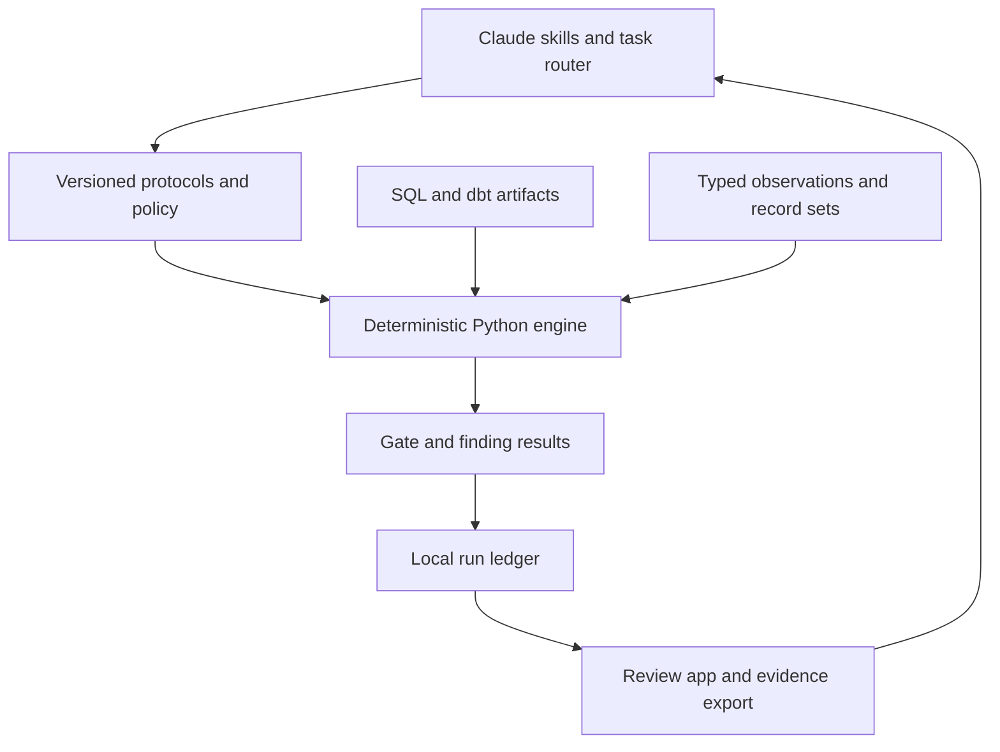

# Architecture

The app uses FastAPI, a small dependency-free browser UI, SQLGlot for BigQuery AST inspection, Pydantic for evidence/model contracts, and SQLite for actual local runs. No model API is required. The browser does not connect directly to BigQuery.

Core responsibilities:
- `sql_audit.py`: single-query parsing, wildcard/cardinality warnings, scoped physical relations and consumption boundaries.
- `manifest.py`: declared model layers, dependencies, consumer impact, published metadata, compiled SQL, unresolved graph checks and cycles.
- `evidence.py`: ordered prerequisites, freshness/context checks, record reconciliation and trace endpoint binding.
- `reconcile.py`: type-preserving keys, missing versus NULL, ambiguous duplicates, per-measure tolerances, bounded samples with full counts, and first observed stage divergence.
- `modeling.py`: typed dimensional specs and dbt scaffolds/tests.
- `store.py`: append-only API writes and content checksums. Direct file/database access can modify this store.
- `demo.py` / `evals.py`: actual synthetic SQLite queries and deterministic regression scenarios.

## Enforcement versus guidance

Skills and protocols guide reasoning. CLI results can fail CI. PostToolUse hooks provide deterministic feedback after edits. Warehouse IAM, deployment controls and protected code review must enforce access and release. Neither Markdown nor this local app can stop tools that bypass it.

## Observation-loop adaptation

The design carries forward explicit identity, versioned configuration, evidence lineage, reproducible counterexamples and reviewed promotion of lessons. Each finding can become a regression fixture; each candidate rule can be tested in shadow before activation. Execution evidence and human approval remain separate concepts.

## Scaling seam

For shared use, replace local shared-token auth with the organization's gateway/identity integration, move run storage behind an authenticated API, and retain warehouse evidence in the approved internal store. For large diffs, run partitioned/key-bucketed checks in BigQuery and import aggregate results plus permitted witnesses through a future attested adapter. Do not simply upload unbounded warehouse extracts to the local comparator.
